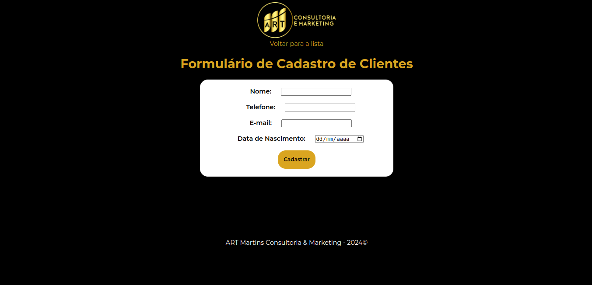
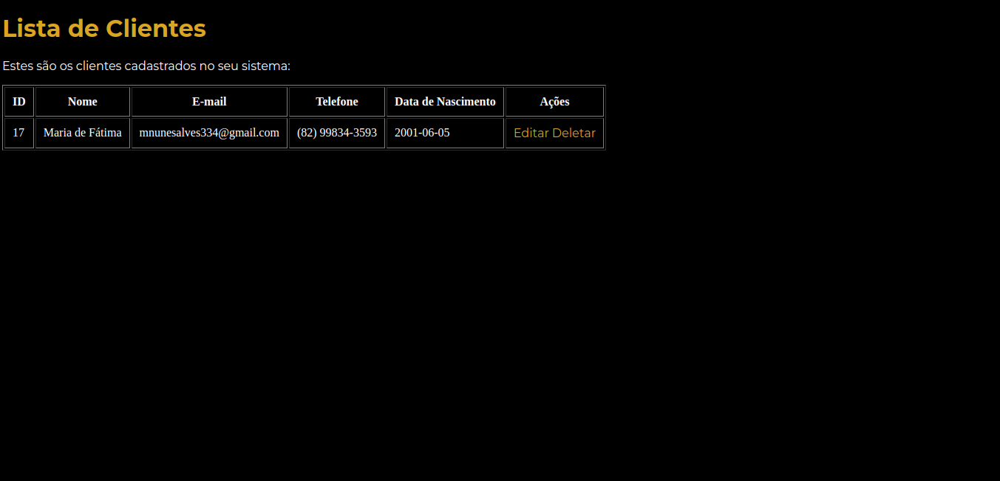
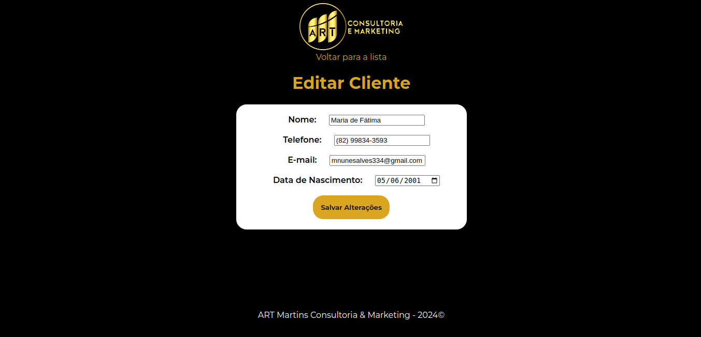
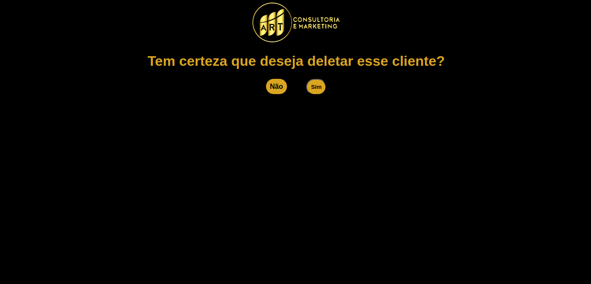

# Formulário para Cadastro de Clientes - CRUD

Este é um projeto de um formulário de cadastro para clientes, com operações básicas de CRUD (Create, Read, Update, Delete). Desenvolvido utilizando HTML, CSS e JavaScript no Frontend, PHP e MariaDB no backend.

# Funcionalidades:

- **Cadastro**: Adicione novos clientes inserindo suas informações básicas.
- **Consulta**: Visualize todos os clientes cadastrados em uma lista.
- **Atualização**: Edite as informações de clientes existentes conforme necessário.
- **Exclusão**: Remova clientes da base de dados com facilidade.

# Tecnologias Utilizadas:

- **Frontend**: HTML, CSS e JavaScript foram utilizados para criar uma interface amigável e responsiva para o formulário de cadastro.
- **Backend**: PHP foi empregado para lidar com as requisições do frontend e a interação com o banco de dados MariaDB.
- **Banco de Dados**: MariaDB foi escolhido como o sistema de gerenciamento de banco de dados, garantindo eficiência e segurança no armazenamento dos dados dos clientes.

# 🌐 Tela de cadastro dos clientes

# 🔎 Tela para visualizar a lista de clientes cadastrados

# ➡️ Tela para editar os dados do cliente

# ⚠️ Tela de aviso para deletar o cliente do sistema

2024 - Maria de Fátima Nunes Alves

